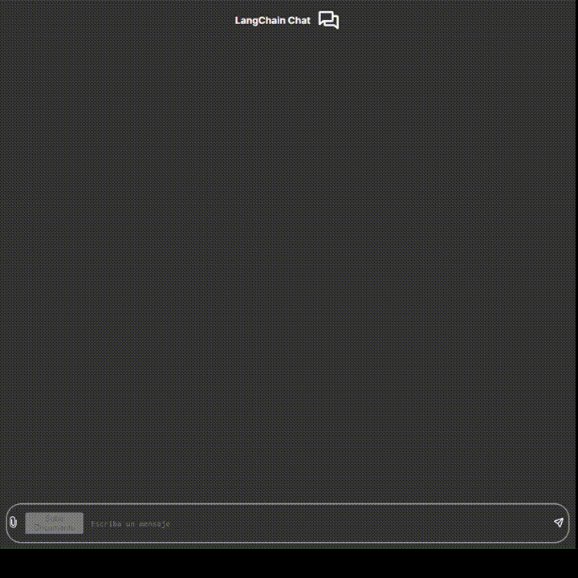
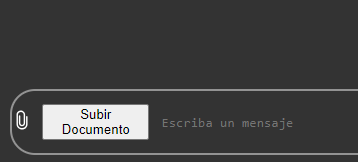
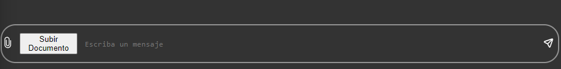

# Chat with RAG using Langchain

Simple Implementation of a Chat using simple RAG techniques.

In order to develop this simple interface we have used FastAPI as a framework for the backend and the API and Next.js as the framework of the React Library to build our frontend.

This project has a simple user interface. The main goal is not to show any espectacular UI/UX but to show how much it is possible to do with very few lines of code.



The project is thought to be simple, so you won't need to create any kind of database or create any services, everything from storing documents and chats will use local memory. Please note this as the project is not based on efficiency.

## Installation instructions for the Inteface

Make sure to have installed Next.js (>=14.0.0) and NPM (>=20.11.0). Check out this links if you don't have installed any of those and come back after.

Now, make sure port 3000 is free. Then you can proceed to install the pkgs needed.

```bash
cd frontend
```

Install the dependencies:

```bash
npm install
```

Run:

```bash
npm run dev
```

## Installation instruction for the API

Make sure to have the correct python version (>=3.11). Chek out this links if you don't have installed any of those and come back after.

```bash
cd backend
```

With `python-venv`

```bash
python -m venv venv
```

With `conda`

```bash
conda create -n venv python=3.11
```

Activate the virtual environment:

**Windows**:

```powershell
.\venv\Scripts\activate
```

**Ubuntu**:

```bash
source venv/bin/activate
```

Check on your terminal if you have your virtual environment active. Then install the dependencies needed to run the fastapi servicve.

```bash
pip install -r requirements.txt
```

Make sure you have a `.env` file based on [.env-template file](./backend/.env-template)

Check out the port: 8000. Change it if it ain't free or stop the process that is running on that port.

```bash
python main.py
```

## How to use

1. Once you have the chat running you should provide the documents you want. Click in the paperclip icon and select the document you want. Make sure it is a .pdf file.

   

Wait until an alert appears indicating if everything is correct.

2. Now you can start chatting. But please, note that `enter` is not used to send the message but to insert a newline. So in order to send the message, be sure to click the button send on the right corner of the Chat Bar.

    


3. Use the Chat Bar to write whatever you want. 
    